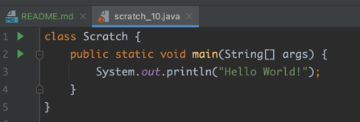
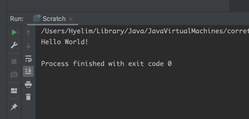
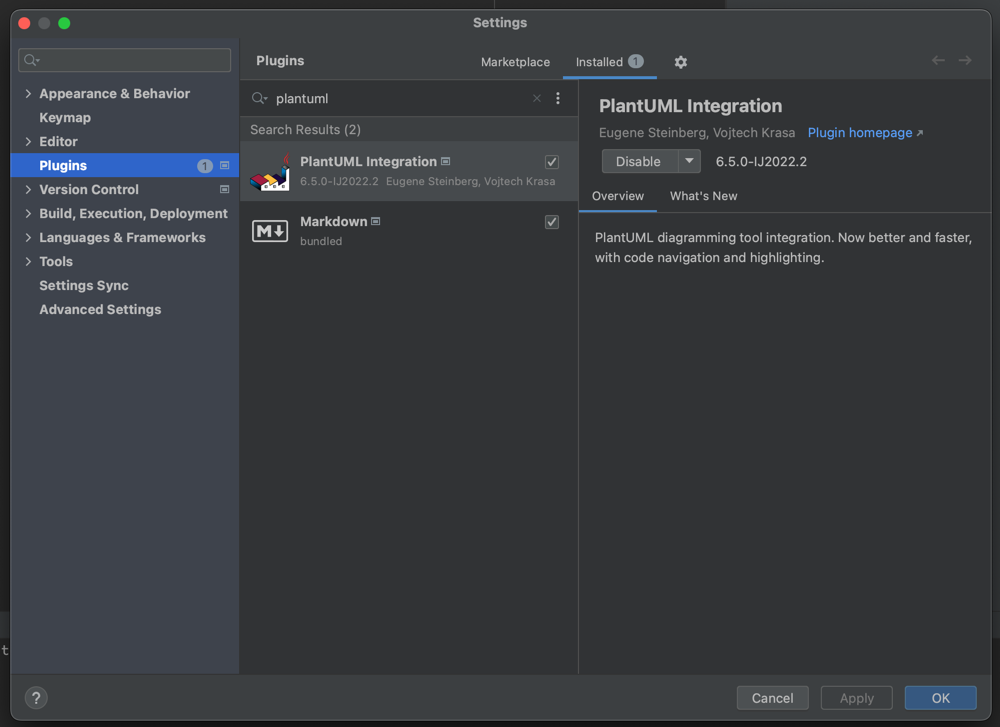
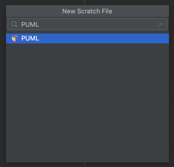
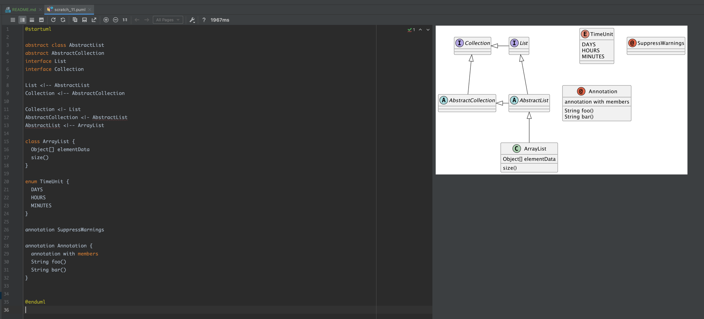
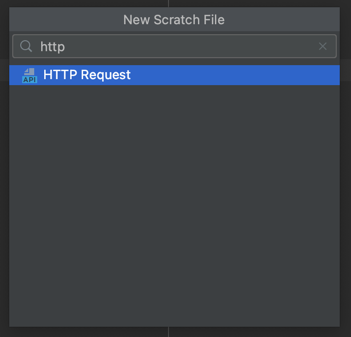
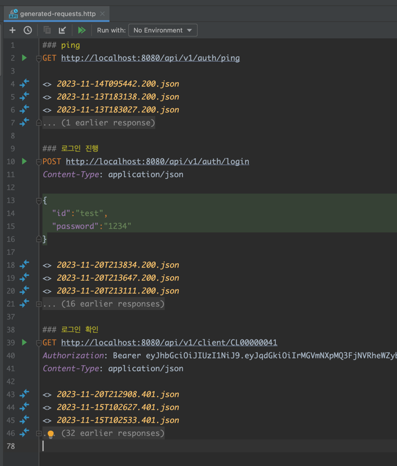
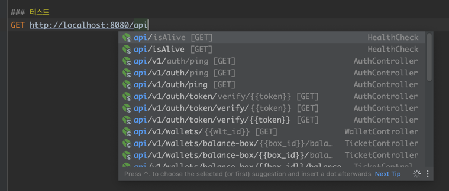
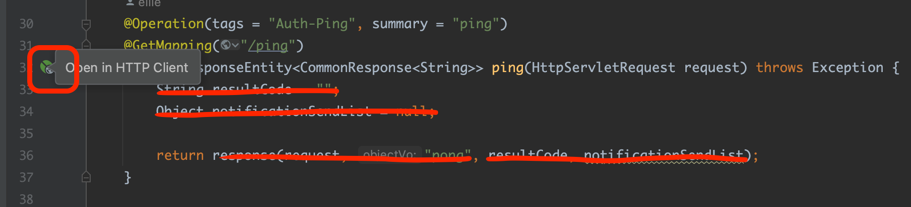

## 인텔리제이 스크래치 파일의 활용

* `⌘⇧ + N` 단축키 또는 `파일 우클릭 + New → Scratch File` 로 생성이 가능하다.
* 아래는 주로 사용하는 방법들이다.
----

### 간단한 코드(예시:java) 실행하기
* 프로젝트에 SDK 만 올바르게 잘 설정되어 있다면, java 형식의 스크래치 파일을 만들면 바로 실행가능한 main 함수를 적어준다.     
   
* 간단하게 Hello World! 를 찍은 모습  

* `⌃⇧R` 단축키로 실행시켜보면 바로 실행 가능하다.
----

### PlantUML 작성하기
* 우선, PlantUML 을 작성 후 보기 위해서는 `PlantUML Integration` 플러그인이 필요하다.  
  
* 플러그인을 설치 후 PUML 형식의 스크래치 파일을 만든다.   
   
* 원하는 내용을 작성한다.  

  
* PlantUML 의 더 많은 기능들은 공식 GitHub 에 잘 설명 되어있다. 다양한 다이어그램을 손쉽게 그릴 수 있다. 
* [PlantUML Official GitHub](https://github.com/plantuml/plantuml)
* (참고) 커뮤니티 버젼에서 가능한지 확인 필요함.

----

### HTTP Request 실행하기
* Http Request 를 요청하기 위해서 웹 브라우저나 Postman 이 없더라도, 인텔리제이에서 손쉽게 요청/응답을 확인할 수 있다.
* 해당 기능은 Ultimate 버전에서 지원함.  
* Http Request 스크래치 파일을 생성한다. 
  
  
* 위와 같이 간단한 GET 요청부터, POST, body data 세팅, Http Header 설정 등이 가능하다.
* Cookie 값 저장, 응답값을 불러와서 다음 request 에 실어보내기 등 많은 기능을 지원함.
* 또한, 스프링 부트 프로젝트에서 실행한다면 API 목록을 후보로 보여준다!
  
* ⌘ 키를 누른 상태에서 URL 을 클릭하면 해당하는 컨트롤러로 바로 이동한다.
* 컨트롤러에서 해당 버튼을 클릭하면 Http Request 구문을 자동으로 만들어준다.  
  
* 덕분에 인텔리제이 하나만 띄워놓고도 디버깅 하기가 매우 편함.
----

### JSON 정렬하기